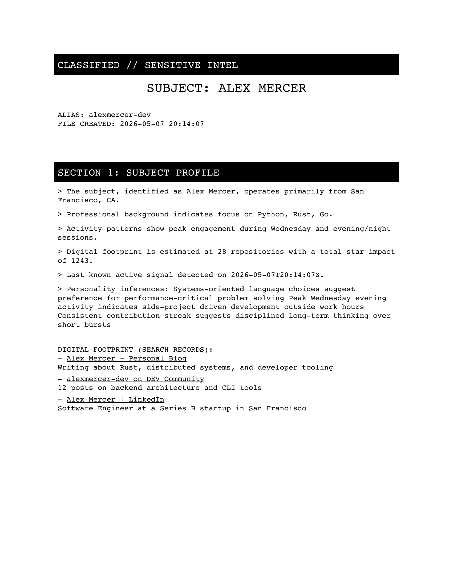

# 🕵️‍♂️ cipherself

**cipherself** is a simple CLI tool that shows you what the public internet knows about you. It scans your GitHub activity and public search records to generate a "declassified" intelligence report about your digital footprint.

[](https://www.python.org/)
[](https://opensource.org/licenses/MIT)

---

## 🔍 What this does

Simply put, **cipherself** takes a GitHub username and a real name, then searches the public web to answer:
- **How do you code?** (Languages used, peak activity hours, account age).
- **What is your public presence?** (Snippets from Google and DuckDuckGo).
- **Social Intelligence?** (Public Reddit activity, karma, and community engagement — **no API keys required**).
- **What can be inferred about you?** (Heuristic analysis of your personality and work style).
- **What is your data worth?** (Estimates of your market value to ad platforms).

All findings are compiled into a styled **PDF Dossier** that looks like a leaked intelligence document.

---

## 📸 Sample Output

### Intelligence Dossier (PDF)

*The report features a dark header, monospace typography, and a "redaction-bar" aesthetic.*

### CLI Interaction
```text
[*] Initiating collection for: Linus Torvalds (@torvalds)
[+] Fetching GitHub intelligence...
[+] Scanning public records via Google...
[*] Attempting Google search for "Linus Torvalds"...
[+] Compiling intelligence report...
[*] Report successfully generated: Linus_Torvalds_exposed.pdf
[*] Operation complete.
```

---

## 🛠️ Installation

### 1. Clone the Repository
```bash
git clone https://github.com/AmeyPacharkar1896/cipherself.git
cd cipherself
```

### 2. Install Dependencies
This project uses [uv](https://github.com/astral-sh/uv) for fast package management.
```bash
uv sync
```

---

## 📖 Usage

Run the tool by providing at least one identifier (GitHub, Name, or Reddit):

```bash
# Full intel
uv run cipherself.py --github <GITHUB-USERNAME> --name <NAME> --reddit <REDDIT-USERNAME>

# Reddit only
uv run cipherself.py --reddit <REDDIT-USERNAME>

# GitHub and Name
uv run cipherself.py --github <GITHUB-USERNAME> --name <NAME>

# Name only (Google search)
uv run cipherself.py --name <NAME>
```

### Options:
- `--github`: The subject's GitHub username (optional).
- `--name`: The subject's real full name (optional).
- `--reddit`: The subject's Reddit username (optional, no API key needed).
- `--demo`: Generate a fictional demo report.
- `--help`: View detailed usage instructions.

---

## 📂 Output Organization

Generated dossiers are automatically organized into subdirectories within the `outputs/` folder based on the sources used for collection:

- **GitHub only**: `outputs/github/`
- **Reddit only**: `outputs/reddit/`
- **Name only**: `outputs/name/`
- **Multiple sources**: `outputs/github_reddit/`, `outputs/github_name/`, etc.
- **Full Intel (All sources)**: `outputs/full/`
- **Demo Mode**: `outputs/demo/`

---

## 🧪 Testing

This project includes a suite of integration tests to ensure CLI stability and correct output organization.

For detailed instructions on running tests, see the [Tests README](tests/README.md).

```bash
uv run python -m unittest discover tests
```

---

## ⚠️ Limitations

- **Public Data Only**: This tool does not access private accounts, deleted data, or password-protected content.
- **Search Scraping**: Web search results depend on public accessibility. Google and DuckDuckGo may occasionally rate-limit requests.
- **Heuristic Inferences**: Personality and work-style inferences are based on common patterns (e.g., "commits at 2 AM = nocturnal") and are intended for research, not definitive profiling.

---

## ⚖️ Disclaimer

**cipherself** is intended for educational and research purposes only. It uses **only** public APIs and publicly accessible information. It does not perform unauthorized access, require login credentials, or store private data. Users are responsible for complying with local privacy laws and platform terms of service.

---

## 📄 License

Distributed under the MIT License. See `LICENSE` for more information.
